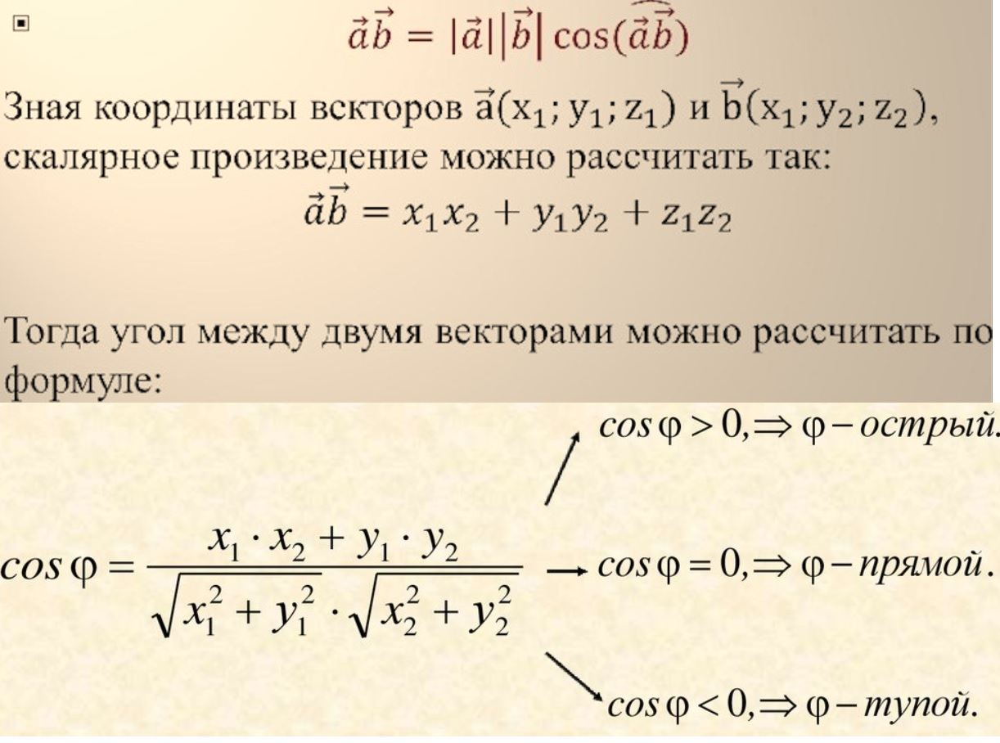

# Скалярное произведение векторов

  

Скалярное произведение двух векторов равно перемножению их длин на косинус угла между ними:
(a,b)=|a||b|cosφ

Также его можно найти сложением перемноженных соответсвующих координат:
(a,b) = ax * bx + ay * by + az * bz...

Скалярное произведение показывает насколько два вектора похожи по направлению друг на друга. Оно равно 0, когда векторы перпендикулярны (т.к. косинус 90 (или 270) градусов = 0).

Если угол между векторами равен 0 градусов (cos0 = 1), то векторы коллинеарны (расположены на одной прямой или на параллельных прямых) и сонаправлены. Их скалярное произведение равно числу - перемножению их длин. 
Если угол между векторами равен 180 градусов (cos180 = -1), то векторы коллинеарны и противонаправлены. Их скалярное произведение равно числу - перемножению их длин, взятому со знаком минус. 

# Векторное произведение векторов

https://ru.wikipedia.org/wiki/Векторное_произведение

# Псевдоскалярное (оно же косое) произведение векторов

Псевдоскалярное произведение векторов показывает насколько два вектора перпендикулярны друг другу.
Псевдоскалярное произведение двух векторов равно перемножению их длин на синус угла между ними:
[a,b]=|a||b|sinφ

Его также можно найти вычислив модуль (длину) векторного произведения двух векторов.
