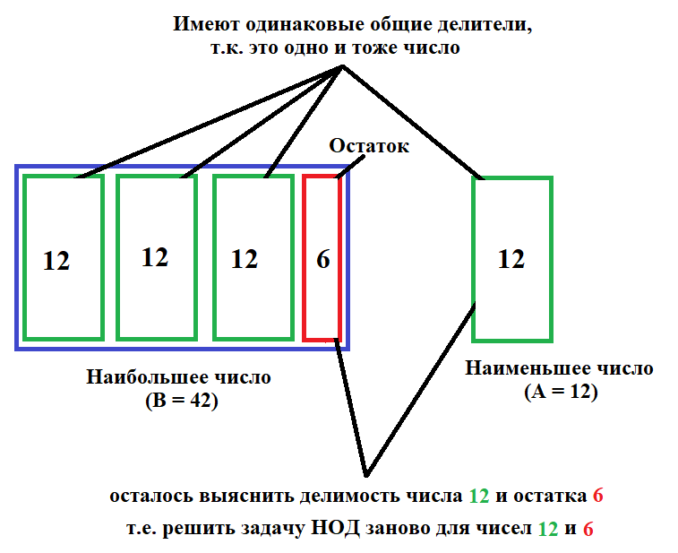

<h1>Интуитивное понимание алгоритма Евклида для НОД</h1>
<h2>Задача</h2>

Найти наибольший общий делитель (далее **НОД** ) и наменьшее общее кратное (далее **НОК**) двух чисел A и B

[Хорошее объяснение на YouTube](https://www.youtube.com/watch?v=8VsHUYiJYBE#t=0m50s) 

<h2>Сам алгоритм (НОД)</h2>
Для примера возьмем два числа - A = 12, B = 42.<br></br>
ㅤㅤ1. Ищем наибольшее число (в примере это B = 42). НОД не может быть больше наименьшего числа (в примере это A = 12).<br></br>
ㅤㅤ2. Делим наибольшее на наименьшее и берем остаток (42 % 12 = 6). Делить наименьшее на наибольшее нет смысла, т.к. остаток всегда будет равен наименьшему.

Если остаток равен 0, то наибольшее число делится нацело на наименьшее, и НОД равен наименьшему (в примере это 12).
Если остаток не равен 0, то НОД могут быть все натуральные числа, начиная от 1, заканчивая наименьшим, не включая его (в примере это 1 2 3 4 5 ... 9 10 11).

Почему мы берем остаток от деления наибольшего на наименьшее?

Наибольшее число (в примере это B) можно представить как: B = n * A + r, где n - целая часть при делении B на A, r - остаток.
(В примере это 42 = 3 * 12 + 6). Т.е. в составе числа B содержится n чисел A, которые имеют такие же делители, как и число A, т.к. это одно и тоже число,
а значит они не влияют на НОД(A, B), и мы можем от них избавиться, записав вместо числа B его остаток при делении на A. 
Теперь A = 12, B = 6.

Суть в том, что число A и остаток при делении B на A имеют такие же делители, как числа А и B, ведь число B состоит из суммы нескольких чисел A и остатка.<br></br>
ㅤㅤ3. Повторяем шаги 1 и 2, пока одно из чисел не будет равно 0. Во втором числе, не равном 0, будет лежать НОД(A, B), т.к. в наибольшее поделилось нацело на наименьшее, и результат записался в наибольшее.

<p align="center">
  
</p>

<h2>НОК</h2>
Для нахождения НОК нужно найти произведение двух чисел и поделить его на НОД. Само произведение уже является общим кратным, но оно может не быть наименьшим.

Для примера возьмем два числа 220 и 16. 220 * 16 = 3520, что является общим кратным. НОД(220, 16) = 4.

3520 состоит из двух множителей - 220 и 16. Если поделить первый множитель 220 на 4, то произведение (220/4) * 16 будет делиться на 16. Но мы также могли поделить и второй множитель 16 на 4, произведение (16/4)*220 будет делиться на 220. Если вместо 4 взять большие кратные одного из этих чисел (например, 22), то поделив их произведение на это число (220 // 22) * 16 оно будет делиться на 16, но на делится на 220 уже не будет, т.к. 16 не делится на 22 (16/22)*220.

Т.е. чтобы сократить произведение, число должно делиться и на первый множитель и на второй.

<h2>Реализация НОД на Python</h2>

```python
def GCD(a, b):
    while a and b:
        if a > b:
            a %= b
        else:
            b %= a
    return a if a else b
```
<h2>Реализация НОД на Python через рекурсию</h2>

```python
def recGCD(a, b):
    if b == 0:
        return a
    return recGCD(b, a % b)
```

<h2>Реализация НОК на Python</h2>

```python
def LCM(a, b):
    return a // GCD(a, b) * b
```


